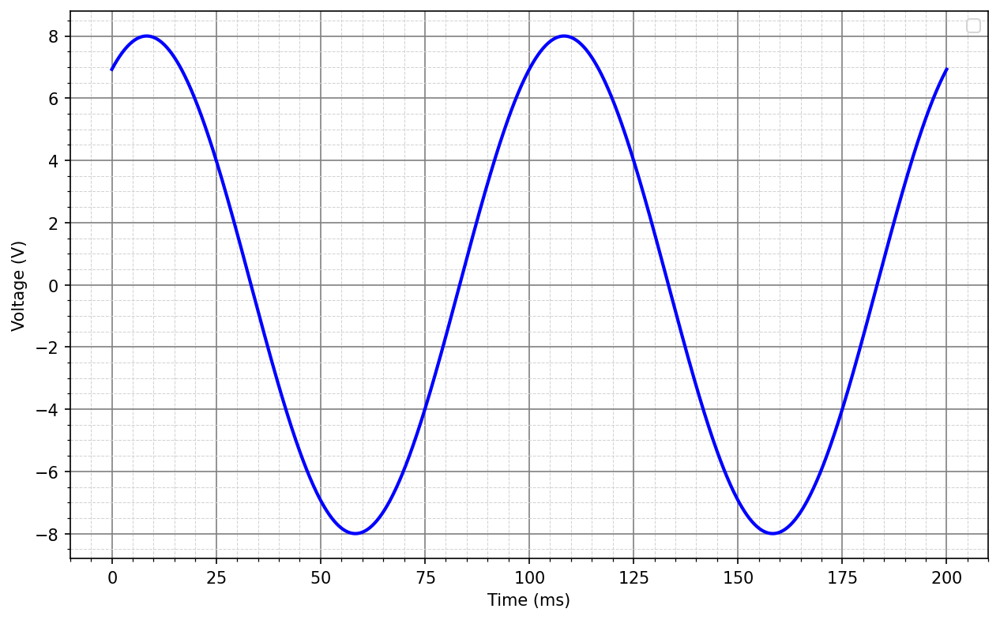

# L10 – Trigonometiska funktioner

## Del 1 - Repetitionsuppgifter

### 1.1 – Laddning av kondensator
En kondensator laddas i en RC-krets med spänningen

```math
u_c (t)=5(1-e^{-t/2})
```

där 
* $u_c(t)$ = spänningen över kondensatorn i $V$,
* $t$ = tiden i sekunder (definierad för $0≤t≤10$).

**a)** Beräkna kondensatorspänningen $u_c(t)$ vid $t=0$.\
**b)** Bestäm spänningens värdemängd.\
**c)** Bestäm den tidpunkt $t$ då spänningen $u_c(t)$ över kondensatorn är $4 V$.

### 1.2 – Rörelse i en servomotor
En servomotors vinkelposition (i grader) ges av

```math
v(t)=-0,5t^2+4t,
```

där $t$ = tiden i sekunder (definierad för $0≤t≤8$).

**a)** Beräkna vinkeln $v$ vid $t = {0,2,4,6,8}$ s.\
**b)** Rita grafen och markera när servomotorn når sin maximala vinkel.\
**c)** Bestäm vid vilka tidpunkter vinkeln är $3,5°$.

### 1.3 – Förstärkning i ett elektroniskt system
I ett förstärkarsystem beskrivs förstärkningen av följande rationella funktion:

```math
G(x)=\frac{x^2+x-12}{x^2-16}
```

där
* $G(x)$ = förstärkningsfaktorn,
* $x$ = en dimensionslös förstärkningsfaktor.

**a)** Faktorisera både täljare och nämnare.\
**b)** Ange vilka värden på x som inte är tillåtna.\
**c)** Förenkla uttrycket så långt som möjligt.

## Del 2 - Nytt stoff

### 2.1 -  Vinklar till radianer
Omvandla följande vinklar till radianer:\
**a)** $-30°$\
**b)** $20°$\
**c)** $225°$\  
**d)** $-45°$\
**e)** $300°$ 


### 2.2 - Vinklar till grader
Omvandla följande vinklar till grader:\
**a)** $π/2$\
**b)** $3π/4$\
**c)** $-5π/6$\
**d)** $-1$\
**e)** $2,2$\

### 2.3. Bestämning av en växelspännings egenskaper

En växelspänning visas i figuren nedan. 



**OBS!** Toppvärdet nås efter ca $8,33 ms$.

Bestäm:
* Spänningens amplitud $|U|$ i $V$.  
* Spänningens frekvens $f$ i $Hz$.  
* Spänningens vinkelhastighet $w$ i $rad/s$.  
* Spänningens fas $δ$ i $rad$.  
* Spänningens ekvation på formen $u(t) = |U|sin(wt + δ)$.

### 2.4 - Växelspänning med given fasförskjutning

En växelspänning har amplituden $3 V$, frekvensen $25 Hz$ och fasen $45°$.  
Bestäm växelspänningens ekvation $u(t)$ med fasen i $rad$ och rita sinuskurvan över en period $T$.

### 2.5 - Beräkning av en växelströms fas

Ekvationen för en växelspänning är:  

```math
u(t) = 5sin(60πt + δ) V.
```

Vid tiden $t = 20 ms$ gäller att $u(t) = 2,5 V$. Beräkna fasen $δ$.
