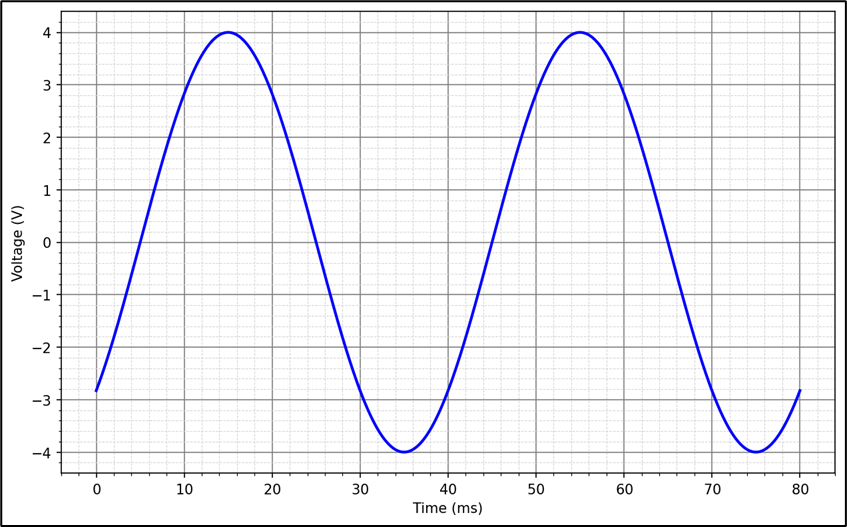

# L11 – Exponentialfunktioner, logaritmer samt decibel

## Del 1 - Repetitionsuppgifter

### 1.1 - Vinklar till radianer
Omvandla följande vinklar till radianer:\
**a)** $15°$\
**b)** $-75°$

### 1.2 – Vinklar till grader
Omvandla följande vinklar till grader:\
**a)** $-π/6$\
**b)** $3π/2$

### 1.3 – Bestämning av en växelspännings egenskaper
En växelspänning visas i figuren nedan.



Bestäm spänningens ekvation på formen $u(t)=|U|sin⁡(wt+δ)$.

### 1.4 – Ekvation samt graf för en växelspänning
En växelspänning har amplituden $4 V$, frekvensen $50 Hz$ och fasen $-30°$.

Bestäm växelspänningens ekvation $u(t)$ (fasen i $rad$) och rita sinuskurvan över en period $T$.

### 1.5 – Beräkning av en växelströms fas
Ekvationen för en given växelspänning är:

```math
u(t)=6sin⁡(80πt+δ)
```

Vid tiden $t=15 ms$ gäller att $u(t)=3 V$. Beräkna fasen $δ$.

## Del 2 - Nytt stoff

### 2.1 - Logaritmiska ekvationer
Lös följande logaritmiska ekvationer:\
**a)** $3^x = 81$\
**b)** $2^{x-1} = 64$\
**c)** $e^{x-2} = 150$


### 2.2 - Halveringstid för laddning i ett batteri  
Ett batteri tappar halva sin laddning på $30$ timmar. Beräkna efter hur lång tid endast $20$ % av laddningen återstår.

### 2.3 -  Linjär förstärkning

Två signaler har spänningsnivåerna $L_1 = 20$ $dB$ och $L_2 = $46$ $dB$.

Beräkna den linjära spänningsförstärkningen $G_{lin}$ mellan dessa två nivåer.  

Använd följande formel:

```math
G_{dB} = 20\log_{10}(G_{lin})  
```

och tänk på att  
$$G_{dB} = L_2 - L_1.$$

### 2.4 - Beräkning av effektivvärde i $dBV$ 
Sambandet mellan en spännings effektivvärde samt motsvarande värde i $dBV$ (decibel Volt) visas nedan:

```math
U_{dBV} = 20 \log_{10} \left( \frac{U_{RMS}}{1\,V} \right)
```
där 
* $U_{RMS}$ = spänningens effektivvärde i $V$,
* $U_{dBV}$ = spänningen i $dBV$.

En sinusspänning har amplitud = $31,0$ $dBV$. Bestäm amplituden i $V$.
