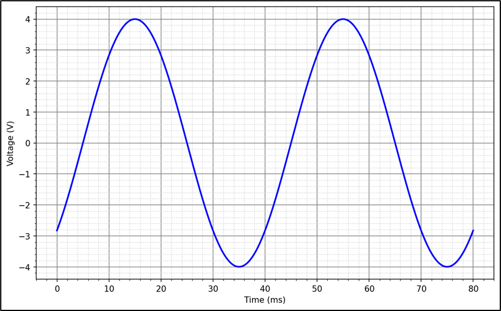
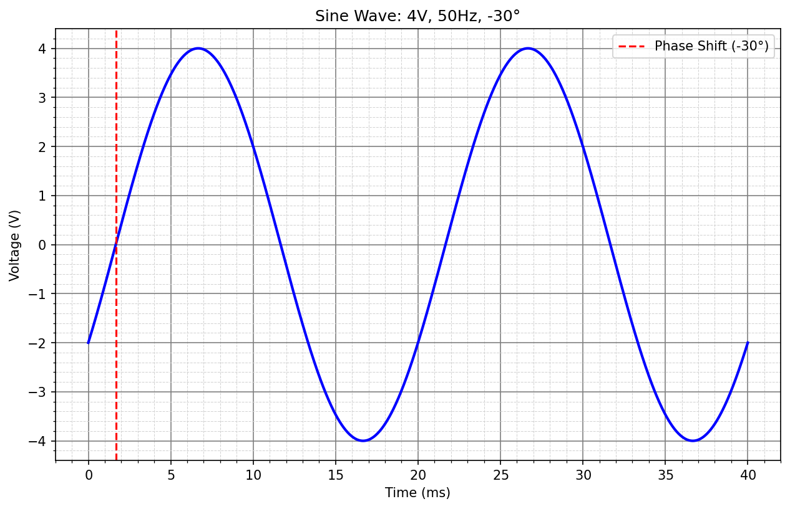

# L11 - Lösningsförslag till övningsuppgifter

### 1.1 - Vinklar till radianer
Omvandla följande vinklar till radianer:\
**a)** $15^\circ$\
**b)** $-75^\circ$

### Lösning

**a)** $15^\circ$ motsvarar $\frac{\pi}{12}$ radianer, då

```math
v_{rad} = \frac{v_{grad} \cdot \pi}{180^\circ} = \frac{15^\circ \cdot \pi}{180^\circ} = \frac{\pi}{12}
```

**b)** $-75^\circ$ motsvarar $\frac{5\pi}{12}$ radianer, då

```math
v_{rad} = \frac{v_{grad} \cdot \pi}{180^\circ} = \frac{-75^\circ \cdot \pi}{180^\circ} = \frac{5\pi}{12}
```

### 1.2 – Vinklar till grader
Omvandla följande vinklar till grader:\
**a)** $-π/6$\
**b)** $3π/2$

### Lösning

**a)** $-π/6$ radianer motsvarar $-30^\circ$, då

```math
v_{grad} = \frac{v_{rad} \cdot 180^\circ}{\pi} = \frac{-π/6 \cdot 180^\circ}{\pi}  = -\frac{180 \cdot \pi}{6\pi} = -30^\circ
```

**b)** $3π/2$ radianer motsvarar $270^\circ$, då

```math
v_{grad} = \frac{v_{rad} \cdot 180^\circ}{\pi} = \frac{3π/2 \cdot 180^\circ}{\pi}  = \frac{540 \cdot \pi}{2\pi} = 270^\circ
```

### 1.3 – Bestämning av en växelspännings egenskaper
En växelspänning visas i figuren nedan.



Bestäm spänningens ekvation på formen $u(t)=|U|sin⁡(wt+δ)$.

### Lösning

Genom att inspektera figuren ser vi att amplituden $|U|$ = $4$ $V$:

```math
|U| = 4 V
```

Vi ser också att periodtiden $T$ = $40$ $ms$, vilket medför att frekvensen $f$ = $25$ $Hz$, då

```math
f = \frac{1}{T} = \frac{1}{40m} = 25 Hz
```

Därmed gäller att vinkelhastigheten $w$ = $50\pi$ $rad/s$, då

```math
w = 2{\pi}f = 2{\pi} * 25 = 50\pi\,{rad/s} 
```

Vi ser också att toppvärdet nås efter $15 ms$. Utan fasförskjutning hade toppvärdet nåtts efter
$1/4$ av periodtiden, vilket i detta fall är $40m$ * $0.25$ = $10$ $ms$. Kurvan är då förskjuten $5$ $ms$ efter i tid. Fasförskutningen $δ$ är därmed negativ:

```math
δ < 0
```

Vi omvandlar förskutningen till radianer. Eftersom en hel period $T$ = $40$ $ms$ motsvarar ett helt varv gäller att $5$ $ms$, som är $5m$ / $40m$ = $1/8$ av ett varv. Eftersom ett varv motsvarar
$2\pi$ radianer gäller då att fasförskjutningen $δ$ är lika med $\frac{\pi}{4}$, då

```math
δ = -2\pi * \frac{1}{8} = -\frac{2\pi}{8} = -\frac{\pi}{4}\,{rad}
```

Spänningens ekvation är därmed lika med

```math
u(t)=|4|sin⁡(50{\pi}t - \frac{\pi}{4}),\text{V}
```

### 1.4 – Ekvation samt graf för en växelspänning
En växelspänning har amplituden $4$ $V$, frekvensen $50$ $Hz$ och fasen $-30°$.

Bestäm växelspänningens ekvation $u(t)$ (fasen i $rad$) och rita sinuskurvan över en period $T$.

### Lösning
Av uppgiftsbeskrivningen vet vi att amplituden $|U|| = $4$ $V$, frekvensen $f$ = $50$ $Hz$ samt att fasen
$δ$ = $-30^\circ$, vilket motsvarar $-\frac{\pi}{6}$ radianer, då

```math
δ = \frac{-30^\circ \cdot \pi}{180^\circ} = -\frac{\pi}{6}\,{rad} 
```

Frekvensen $f$ = $50$ $Hz$ medför att periodtiden $T$ = $20$ $ms$, då

```math
T = \frac{1}{f} = \frac{1}{50} = 0,02\,{s} = 20\,{ms}
```

En fasförskjutning $δ$ på -\frac{\pi}{6}\,{rad} motsvarar $1/12$ av ett varv, då

```math
\frac{(\frac{\pi}{6})}{2\pi} = \frac{\pi}{6 \cdot 2\pi} = \frac{1}{12}
```

Att fasen $δ$ är negativ indikerar att spänningen är $1/12$ efter i tid. Eftersom periodtiden $T$
är lika med $20$ $ms$ gäller att spänningen är ${1,675}$ $ms$ efter i tid, då

```math
{\delta} = T \cdot \frac{1}{12} = 20m \cdot \frac{1}{12} = \frac{20}{12} = 1,675\,{ms} 
```

Med denna information kan vi rita ut spänningen såsom visas nedan:




### 1.5 – Beräkning av en växelströms fas
Ekvationen för en given växelspänning är:

```math
u(t)=6sin⁡(80πt+δ)
```

Vid tiden $t=15$ $ms$ gäller att $u(t) = 3$ $V$. Beräkna fasen $δ$.

### Lösning
Av ovanstående information kan ovanstående ekvation skrivas (med tiden $t$ i sekunder):

```math
u(0,015)=6sin⁡(80\pi \cdot 0,015 + δ) = 3,
```

vilket kan förenklas till

```math
6sin⁡(1,2\pi + δ) = 3
```

Vi dividerar med $6$ i respektive led:

```math
sin⁡(1,2\pi + δ) = 0,5
```

Vi använder sedan $sin^-1$ för att beräkna rötterna. För en sinusekvation $sin$ $v$ = $x$ gäller att

```math
v_1 = \sin^{-1}(x)
```

```math
v_2 = \pi - \sin^{-1}(x)
```

Vi beräknar den första roten $δ_1$ via den första ekvationen ovan:

```math
1,2\pi + δ_1 = \sin^{-1}(0,5),
```

vilket kan omvandlas till

```math
δ_1 = \sin^{-1}(0,5) - 1,2\pi ≈ - 3,24\,{rad}
```

Vi beräknar sedan den andra roten $δ_2$ via den andra ekvationen ovan:

```math
1,2\pi + δ_2 = \pi - \sin^{-1}(0,5),
```

vilket kan omvandlas till

```math
δ_2 = \pi - \sin^{-1}(0,5) - 1,2\pi ≈ -1,15\,{rad}
```

Vi kontrollräknar de erhållna rötterna - vid $t$ = $0,015$ s bör spänningen $u(0,015)$ vara lika med 3 V.

Vid börjar med den första roten $δ_1$ ≈ $-3,24$ $rad$:

```math
u(0,015)=6sin⁡(80\pi \cdot 0,015 -3,24) = 3\,{V}\,{=> OK!}
```

Vi testar sedan den andra roten $δ_2$ ≈ $-1,15$ $rad$:

```math
u(0,015)=6sin⁡(80\pi \cdot 0,015 -1,15) = 3\,{V}\,{=> OK!}
```

## Del 2 - Nytt stoff

### 2.1 - Logaritmiska ekvationer
Lös följande logaritmiska ekvationer:\
**a)** $3^x = 81$\
**b)** $2^{x-1} = 64$\
**c)** $e^{x-2} = 150$

#### Lösning

**a)** Vi utnyttjar att $log\,{3^x}$ = $x * log\,{3}$. Därmed logaritmerar vi respektive led:

```math
x \cdot log\,{3} = log\,{81}
```

Genom att dividera med $log\,{3}$ i respektive led kan vi sedan beräkna $x$:

```math
x = \frac{log\,{81}}{log\,{3}} = 4
```

**b)** Vi utnyttjar att $log$ $2^{x - 1}$ = $(x - 1) * log\,2$. Därmed logaritmerar vi respektive led:

```math
(x - 1) * log\,2 = log\,{64}
```

Vi dividerar sedan med $log\,{2}$ i respektive led:

```math
x - 1 = \frac{log\,{64}}{log\,{2}}
```

Vi adderar sedan $1$ i respektive led för att beräkna $x$:

```math
x = \frac{log\,{64}}{log\,{2}} + 1 = 6 + 1 = 7
```

**c)** Vi utnyttjar att $ln$ $e^{x - 2}$ = $x - 2$, då

```math
ln\,e^{x - 2} = (x - 2) * ln\,e
```

samt att $ln\,{e}\,=\,{1}$, vilket medför att

```math
(x - 2) * ln\,e = (x - 2) * 1 = x - 2
```
Därmed logaritmerar vi respektive led:

```math
(x - 2) = ln\,{150}
```

Vi adderar sedan $2$ i respektive led för att beräkna $x$:

```math
x = ln\,{150} + 2 ≈ 5,01 + 2 = 7,01
```

### 2.2 - Halveringstid för laddning i ett batteri  
Laddningen för ett batteri kan beskrivas via motsvarande spänning i enlighet med följande funktion:

```math
u(t) = U_0 * a^t
```

där 
* $u(t)$ är nuvarande laddning,
* $U_0$ är den ursprungliga laddningen,
* $a$ är förändringsfaktorn,
* $t$ är antalet passerade timmar.

Ett batteri tappar halva sin laddning på $30$ timmar. Beräkna efter hur lång tid endast $20$ % av laddningen återstår.

#### Lösning
Förändringsfaktorn $a$ är okänd, men kan beräknas, då vi vet att halveringstiden är $30$ timmar. Med andra ord, om $U_0$ är den ursprungliga laddningsmängden så återstår $0,5U_0$ efter 30 timmar:

```math
u(30) = U_0 ∗ a^{30} = 0,5U_0
```

Vi dividerar med $U_0$ i båda led och erhåller då följande ekvation:

```math
a^{30} = 0,5
```

Vi upphöjer sedan båda led med exponenten $1/30$ för att isolera förändringsfaktorn $a$ i vänsterledet, då

```math
a^{30 \cdot 1/30} = a
```

Därmed gäller att

```math
a = 0,5^{1/30} ≈ 0,977
```

Vi lägger till den beräknade förändringsfaktorn $a$ i ovanstående funktion:

```math
u(t) ≈ U_0 ∗ 0,977^t
```

Vi söker sedan efter hur många timmar $t$ som halveringstiden är nere på $20$ % av den ursprungliga mängden. Med andra ord, om $U_0$ är den ursprungliga laddningsmängden söker vi efter hur många timmar $t$ som kvarvarande mängd $u(t)$ är lika med $0,2U_0$:

```math
u(t) ≈ U_0 ∗ 0,977^t=0,2U_0
```

Återigen dividerar vi $U_0$ i båda led:

```math
0,977^t=0,2
```

För att få ned $t$ från exponenten i vänsterledet använder vi logaritmer i både led. För vänsterledet gällande följande:


```math
log\,{0,977^t} = t \cdot log\,{0,977}
```

Ekvationen kan därmed skrivas om till följande:

```math
t \cdot log\,{0,977} = log\,{0,2}
```

Vi dividerar sedan med $log\,{0,977}$ i både led för att få $t$ isolerad i vänsterledet:

```math
t = \frac{log\,{0,2}}{log\,{0,977}} ≈ 69,66\,{h}
```

Detta motsvarar ungefär $69$ timmar samt $40$ minuter, då

```math
0,66 ∗ 60 𝑚𝑖𝑛 ≈ 39,5\,{min}
```

### 2.3 – Linjär förstärkning

Två signaler har spänningsnivåerna $L_1 = 20\,\text{dB}$ och $L_2 = 46\,\text{dB}$.

Beräkna den linjära spänningsförstärkningen $G_{lin}$ mellan dessa två nivåer.  

Använd följande formel:

```math
G_{dB} = 20\log_{10}(G_{lin})  
```

och tänk på att  
```math
G_{dB} = L_2 - L_1.
```


#### Lösning

Vi beräknar först skillnaden i `dB`:

```math
G_{dB} = L_2 - L_1 = 46\,\text{dB} - 20\,\text{dB} = 26\,\text{dB}
```

Därefter beräknar vi den linjära förstärkningen:

```math
G_{lin} = 10^{G_{dB}/20} = 10^{26/20} \approx 10^{1.3} \approx 19.95
```

### 2.4 – Beräkning av effektivvärde i $dBV$

Sambandet mellan en spännings effektivvärde samt motsvarande värde i $dBV$ (decibel Volt) visas nedan:

```math
U_{dBV} = 20 \log_{10} \left( \frac{U_{RMS}}{1\,V} \right)
```
där 
* $U_{RMS}$ = spänningens effektivvärde i $V$,
* $U_{dBV}$ = spänningen i $dBV$.

En sinusspänning har amplitud = $31,0$ $dBV$. Bestäm amplituden i $V$.

#### Lösning

Vi transformerar ovanstående formel för att beräkna $U_{RMS}$. Vi börjar med att vända på
uttrycket samt dividera med $20$ i respektive led:

```math
log_{10} \left( \frac{U_{RMS}}{1\,V} \right) = \frac{U_{dBV}}{20}
```

Vi upphöjer sedan båda led med basen $10 för att isolera $\frac{U_{RMS}}{1\,V}$ i vänsterledet, då

```math
10^{log_{10} \left( \frac{U_{RMS}}{1\,V} \right)} = \frac{U_{RMS}}{1\,V}
```

Därmed gäller att

```math
\frac{U_{RMS}}{1\,V} = 10^{\frac{U_{dBV}}{20}},
```

vilket är ekvivalent med att

```math
U_{RMS} = 10^{\frac{U_{dBV}}{20}} * 1\,{V} = 10^{\frac{U_{dBV}}{20}}
```

Vi beräknar sedan $U_{RMS}$ genom att sätta in $U_{dbB}$ = $31$ $dbV$ i uttrycket:

```math
U_{RMS} = 10^{\frac{31}{20}} \approx 35,5\,V
```

Vi beräknar sedan spänningens amplitud via motsvarande RMS-värde:

```math
U_{RMS} = \frac{|U|}{\sqrt{2}},
```

vilket innebär att

```math
|U| = U_{RMS} * \sqrt{2} \approx 35,5 * \sqrt{2} \approx 50,2\,{V}
```

Spänningens amplitud $|U|$ uppgår därmed till ca $50,2\,V$.
