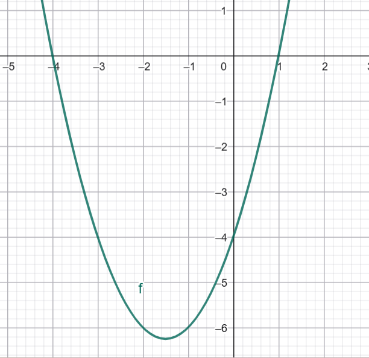

# L15 – Integraler

## Dagordning
* Innebörd samt beräkning med integraler.
* Integreringsregler.

## Mål med lektionen
* Förstå vad integraler är.
* Förstå begreppet primitiv funktion och ta fram denna för enkla funktioner.
* Kunna utföra enkla integreringar.

## Instruktioner

* Vänligen se följande [video](https://www.youtube.com/watch?v=__Uw1SXPW7s&authuser=0) för att få 
lite information om integraler som koncept.

* Vänligen läs följande litteratur innan lektionen:
    * [Beräkning av integraler](https://www.matteboken.se/lektioner/matte-3/integraler/berakning-av-integraler)
    * [Primitiv funktion](https://www.matteboken.se/lektioner/matte-3/integraler/primitiv-funktion)
    * [Area mellan två kurvor](https://www.matteboken.se/lektioner/matte-3/integraler/arean-mellan-tva-kurvor)
    * [Räkneregler för integraler](https://www.matteboken.se/lektioner/matte-4/integraler/rakneregler-for-integraler)

* Genomför **typexemplen** [här](./docs/L15_examples.pdf).
* **Lektionsuppgifter** finns [här](./docs/L15_exercises.md). **Lösningsförslag** läggs upp efter lektionen.

* Extra uppgifter: 
    * Räkna uppgifterna som finns under länkarna till Matteboken ovan (se flikarna som heter Uppgifter & Exempel).
    * [Övningsuppgifter - integraler](./docs/L15_integrals.pdf)
    * [Övningsuppgifter - derivata och integraler](./docs/L15_derivate_integrals.pdf)

## Demonstration
* Integrering av funktionen $f(x) = x^2 + 3x - 4$ för att bestämma arean mellan $-4\,{\le} x\, {\le} 1$.

* Integrering av $i(t) = 2t + 4$ med startström $i(0)$ = $1$ $A$.

## Utvärdering
* Några synpunkter på lektionen?

## Nästa lektion
* Innebörd samt beräkning med komplexa tal.
* Omvandling av komplexa tal från polär till rektangulär form.