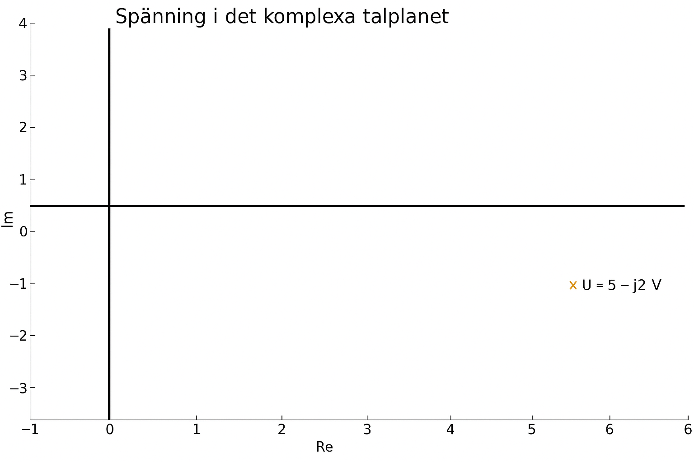
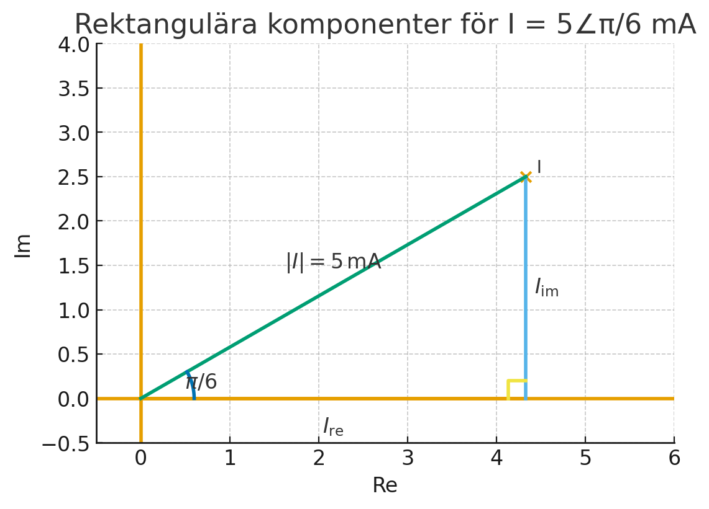

# L16 - Lösningsförslag till lektionsuppgifter

## Del 1 - Repetitionsuppgifter

### 1.1 - Återfå tidsfunktion från derivata (spänningssignal)

En sensorspänning $u(t)$ i en mätkrets är inte känd direkt, men dess derivata $u'(t)$ är uppmätt till

```math
u'(t) = 6t − 4\,\,\text{V/s}
```

Det är också känt att startspänningen $u(0)$ = $2$ $V$.

**a)** Bestäm ett uttryck för u(t).\
**b)** Bestäm spänningen efter $3$ sekunder.

### Lösning
**a)** Vi integrerar $u'(t)$ för att bestämma $u(t)$:

```math
u(t) = \int u'(t)\,\,dt = \int (6t - 4)\,\,dt = \frac{6t^2}{2} - 4t + C,
```

vilket kan skrivas om till

```math
u(t) = 3t^2 - 4t + C
```

Vi kan också bestämma integrationskonstanten $C$, då vi känner till att startspänningen $u(0) = 2$ $V$:

```math
u(0) = 3 * 0^2 - 4 * 0 + C = 2,
```

vilket kan skrivas om till

```math
C = 2
```

Därmed kan ett slutgiltigt uttryck för $u(t)$ bestämmas:

```math
u(t) = 3t^2 - 4t + 2\,\,V
```

**b)** För att bestämma spänningen efter $3$ sekunder beräknar vi $u(3)$:

```math
u(3) = 3 * 3^2 - 4 * 3 + 2 = 3 * 9 - 12 + 2 = 17\,\,V
```

---

## Del 2 - Nytt stoff

### 2.1 - Rektangulär => polär form
Omvandla spänningen $U = 5 - j2$ $V$ till polär form.

### Lösning

Vi vill bestämma spänningen $U$ på följande form:

```math
U = |U|\,\,<\,δ_u\,\,V,
```

där
* $|U|$ = spänningens absolutbelopp (och tillika amplitud),
* $δ_u$ = spänningens fasvinkel.

Vi börjar med att rita ut $U$ i det komplexa talplanet, såsom visas nedan:



Spänningens absolutbelopp (och tillika amplitud) $|U|$ kan enkelt beräknas via Pythagoras sats:

```math
|U| = \sqrt{5^2 + (-2)^2} = \sqrt{25 + 4} = \sqrt{29} \approx 5,39\,\, V
```

Vi beräknar sedan spänningens fasvinkel $δ_u$ med $tan^{-1}$:

```math
\tan δ_u = \frac{-2}{5},
```

vilket kan skrivas om till

```math
δ_u = \tan^{-1} \frac{-2}{5} \approx -0,38 \pm k{\pi} \approx -21,8° \pm k * 180°.
```

Eftersom $U$ ligger i fjärde kvadranten $(270°≤δ_u≤360°)$ samt att $-21,8° = 360°-21,8°=338,2°$ är den beräknade fasvinkeln $δ_u$ korrekt.

Därmed gäller att

```math
U = 5 - j2 \approx 5,39\,\,∠\,-0,38\,\,rad\,\,V
```

---

### 2.2 - Polär => rektangulär form
Omvandla strömmen $I = 5$ $∠$ $\frac{\pi}{6}$ $mA$ till rektangulär form.

### Lösning

Vi vill bestämma strömmen $I$ på följande form:

```math
I = I_{re} + jI_{im},
```

där
* $I_{re}$ = strömmens reella del,
* $I_{im}$ = strömmens imaginära del. 

Enligt uppgift är strömmens absolutbelopp (och tillika amplitud) $|I|=5$ $mA$. Vi känner också till att strömmens fasvinkel $δ_i = $\frac{\pi}{6}$ $rad$, vilket medför att strömmen kan visualiseras som en triangel i det komplexa talplanet, såsom visas nedan: 



Som synes kan den reella delen $I_{re}$ samt den imaginära delen $I_{im}$ beräknas trigonometriskt (via cosinus samt sinus).

Vi beräknar först den reella delen $I_{re}$ med cosinus:

```math
\cos δ_i = \frac{I_{re}}{|I|},
```

som kan skrivas om till

```math
I_{re} = |I| * \cos δ_i
```

Genom att sätta in värden i ovanstående uttryck ser vi att $I_{re} \approx 4,33$ $mA$, då

```math
I_{re} = 5 * \cos \frac{\pi}{6} \approx 4,33\,\,mA
```

Vi beräknar sedan den imaginära delen $I_{im}$ med sinus:

```math
\sin δ_i = \frac{I_{im}}{|I|},
```

som kan skrivas om till

```math
I_{im} = |I| * \sin δ_i
```

Genom att sätta in värden i ovanstående uttryck ser vi att $I_{im} = 2,5$ $mA$, då

```math
I_{im} = 5 * \sin \frac{\pi}{6} = 2,5\,\,mA
```

Därmed kan strömmen $I$ skrivas på rektangulär form såsom visas nedan:

```math
I \approx 4,33 + j2,5\,\,mA
```

---

### 2.3 - Beräkning av impedans
En krets matas med spänningen från uppgift *2.1*. Strömmen från uppgift *2.2* flödar genom kretsen.
Beräkna kretsens impedans $Z$ med "Ohms lag":

```math
Z = \frac{U}{I},
```

där
* $Z$ = kretsens impedans i $\Omega$,
* $U$ = matningsspänningen i $V$,
* $I$ = strömmen genom kretsen i $mA$.

Svara både i polär samt rektangulär form.

---

### Lösning

Vi beräknar impedansen $Z$ genom att bestämma kvoten $\frac{U}{I}$ på polär form:

```math
Z = \frac{U}{I} \approx \frac{5,39\,\,∠\,-0,38}{5m\,∠\,\frac{\pi}{6}}
```

Impedansens amplitud $|Z|$ beräknas genom att dividera spänningens samt strömmens amplituder $|U|$ samt $|I|$.
Eftersom spänningen mäts i $V$ och strömmen mäts i $mA$ erhålls svaret i $k\Omega$:

```math
|Z| = \frac{|U|}{|I|} \approx \frac{5,39}{5m} \approx 1,08\,\,k\Omega
```

Impedansens fasvinkel $δ_z$ erhålls genom att subtrahera spänningens samt strömmens fasvinklar $δ_u$ samt $δ_i$:

```math
δ_z = δ_u - δ_i \approx -0,38 - \frac{\pi}{6} \approx -0,9\,\, rad
```

**Notering**: Anledningen till att vi subtraherar dessa är på grund av divisionen $Z = \frac{U}{I}$; fasvinklar beräknas som
exponenter, varvid division medför subtraktion, medan multiplikation medför addition.

Därmed kan impedansen $Z$ uttryckas på polär form såsom visas nedan:

```math
Z \approx 1,08\,\,∠\,-0,9\,\,rad\,\,k\Omega
```

Vi omvandlar sedan $Z$ till rektangulär form på samma sätt som genomfördes för strömmen $I$ i *2.2*.

Den reella delen $Z_{re}$ beräknas enkelt via cosinus:

```math
Z_{re} = |Z| * \cos δ_z \approx 1,08 * \cos -0,9 \approx 0,67\,\,k\Omega
```

Den imaginära delen $Z_{im}$ beräknas enkelt via sinus:

```math
Z_{im} = |Z| * \sin δ_z \approx 1,08 * \sin -0,9 \approx -0,85\,\,k\Omega
```

Därmed kan impedansen $Z$ skrivas på rektangulär form såsom visas nedan:

```math
Z \approx 0,67 - j0,85\,\, k\Omega
```

---
