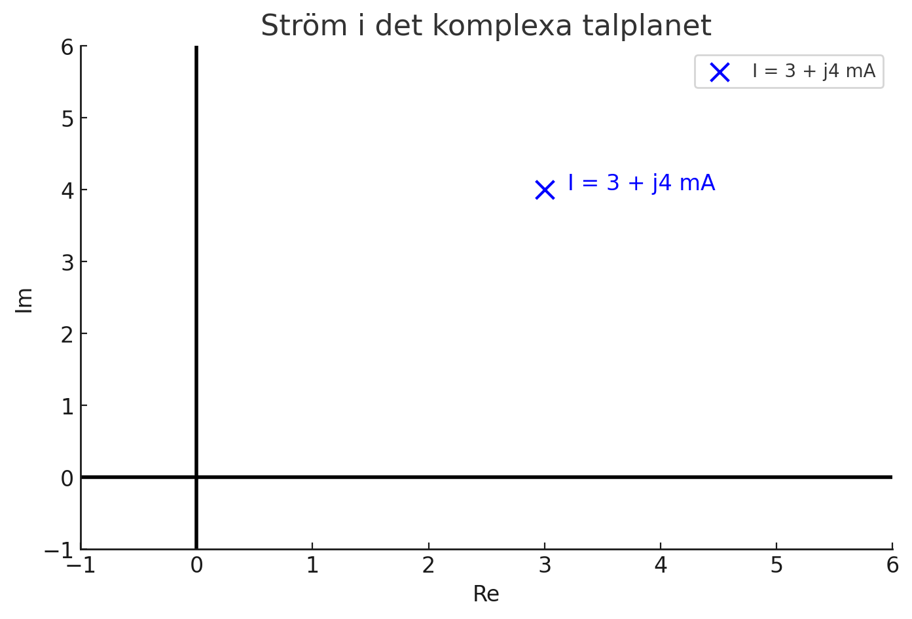
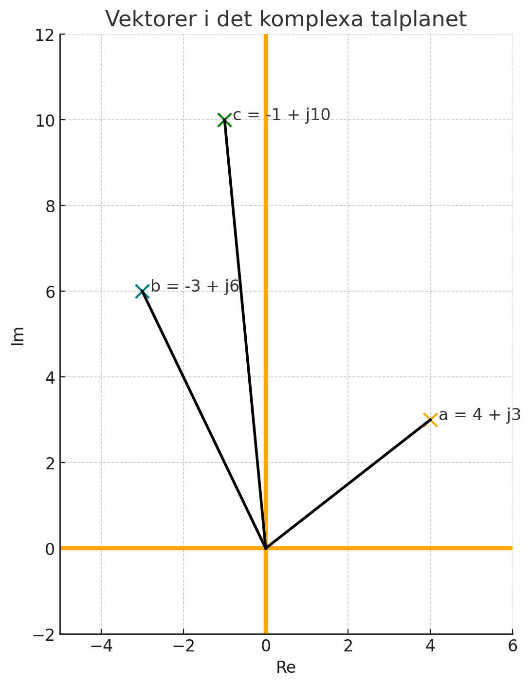
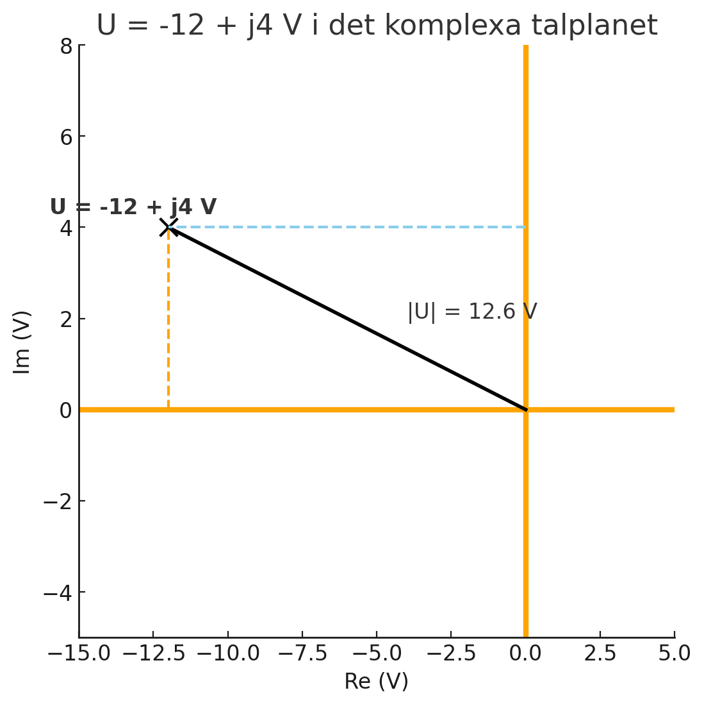

# L17 - Lösningsförslag till lektionsuppgifter

## Del 1 - Repetitionsuppgifter

### 1.1 - Rektangulär => polär form
Omvandla strömmen $I = 3 + j4$ $mA$ till polär form.

### Lösning

Vi vill bestämma strömmen $I$ på följande form:

```math
I = |I|\,\,<\,δ_i\,\,mA,
```

där
* $|I|$ = strömmen absolutbelopp (och tillika amplitud),
* $δ_i$ = strömmen fasvinkel.

Vi börjar med att rita ut $I$ i det komplexa talplanet, såsom visas nedan:



Strömmens absolutbelopp (och tillika amplitud) $|I|$ kan enkelt beräknas via Pythagoras sats:

```math
|I| = \sqrt{3^2 + 4^2} = \sqrt{16 + 9} = \sqrt{25} = 5\,\, mA
```

Vi beräknar sedan strömmens fasvinkel $δ_i$ med $tan^{-1}$:

```math
\tan δ_i = \frac{4}{3},
```

vilket kan skrivas om till

```math
δ_i = \tan^{-1} \frac{4}{3} \approx 0,93 \pm k{\pi} \approx 51,13° \pm k * 180°.
```

Eftersom $I$ ligger i första kvadranten $(0°≤δ_i≤90°)$ så är den beräknade fasvinkeln $δ_i$ korrekt.

Därmed gäller att

```math
I = 3 + j4 \approx 5\,\,∠\,0,93\,\,rad\,\,mA
```

---

### 1.2 - Polär => rektangulär form
Omvandla spänningen $U = 2$ $∠$ $\frac{\pi}{4}$ $V$ till rektangulär form.

### Lösning

Vi vill bestämma spänningen $U$ på följande form:

```math
U = U_{re} + jU_{im},
```

där
* $U_{re}$ = spänningens reella del,
* $U_{im}$ = spänningens imaginära del. 

Enligt uppgift är spänningens absolutbelopp (och tillika amplitud) $|U|=2$ $V$. Vi känner också till att spänningens fasvinkel $δ_u = $\frac{\pi}{4}$ $rad$, vilket medför att spänningen kan visualiseras som en triangel i det komplexa talplanet, såsom visas nedan: 


Som synes kan den reella delen $U_{re}$ samt den imaginära delen $U_{im}$ beräknas trigonometriskt (via cosinus samt sinus).

Vi beräknar först den reella delen $U_{re}$ med cosinus:

```math
\cos δ_u = \frac{U_{re}}{|U|},
```

som kan skrivas om till

```math
U_{re} = |U| * \cos δ_u
```

Genom att sätta in värden i ovanstående uttryck ser vi att $U_{re} \approx 1,41$ $V$, då

```math
U_{re} = 2 * \cos \frac{\pi}{4} \approx 1,41\,\,V
```

Vi beräknar sedan den imaginära delen $U_{im}$ med sinus:

```math
\sin δ_u = \frac{U_{im}}{|U|},
```

som kan skrivas om till

```math
U_{im} = |U| * \sin δ_u
```

Genom att sätta in värden i ovanstående uttryck ser vi att även $U_{im} \approx 1,41 $ $V$, då

```math
U_{im} = 2 * \sin \frac{\pi}{4} \approx 1,41\,\,mA
```

Därmed kan spänningen $U$ skrivas på rektangulär form såsom visas nedan:

```math
U \approx 1,41 + j1,41\,\,V
```

---

### 1.3 - Beräkning av impedans
En krets matas med spänningen från uppgift *1.2*. Strömmen från uppgift *1.1* flödar genom kretsen.
Beräkna kretsens impedans $Z$ med "Ohms lag":

```math
Z = \frac{U}{I},
```

där
* $Z$ = kretsens impedans i $\Omega$,
* $U$ = matningsspänningen i $V$,
* $I$ = strömmen genom kretsen i $mA$.

Svara både i polär samt rektangulär form.

## Lösning

Vi beräknar impedansen $Z$ genom att bestämma kvoten $\frac{U}{I}$ på polär form:

```math
Z = \frac{U}{I} \approx \frac{2\,\,∠\,\frac{\pi}{4}}{5m\,∠\,0,93}
```

Impedansens amplitud $|Z|$ beräknas genom att dividera spänningens samt strömmens amplituder $|U|$ samt $|I|$.
Eftersom spänningen mäts i $V$ och strömmen mäts i $mA$ erhålls svaret i $k\Omega$:

```math
|Z| = \frac{|U|}{|I|} = \frac{2}{5m} = 0,4\,\,k\Omega
```

Impedansens fasvinkel $δ_z$ erhålls genom att subtrahera spänningens samt strömmens fasvinklar $δ_u$ samt $δ_i$:

```math
δ_z = δ_u - δ_i \approx \frac{\pi}{4} - 0,93 \approx -0,14\,\, rad
```

**Notering**: Anledningen till att vi subtraherar dessa är på grund av divisionen $Z = \frac{U}{I}$; fasvinklar beräknas som exponenter, varvid division medför subtraktion, medan multiplikation medför addition.

Därmed kan impedansen $Z$ uttryckas på polär form såsom visas nedan:

```math
Z \approx 0,4\,\,∠\,-0,14\,\,rad\,\,k\Omega
```

Vi omvandlar sedan $Z$ till rektangulär form på samma sätt som genomfördes för spänningen $U$ i *1.2*.

Den reella delen $Z_{re}$ beräknas enkelt via cosinus:

```math
Z_{re} = |Z| * \cos δ_z \approx 0,4 * \cos -0,14 \approx 0,4\,\,k\Omega
```

Den imaginära delen $Z_{im}$ beräknas enkelt via sinus:

```math
Z_{im} = |Z| * \sin δ_z \approx 0,4 * \sin -0,14 \approx -0,06\,\,k\Omega
```

Därmed kan impedansen $Z$ skrivas på rektangulär form såsom visas nedan:

```math
Z \approx 0,4 - j0,06\,\, k\Omega
```

Impedansen kan också med fördel omvandlas till $\Omega$:

```math
Z \approx 400 - j60\,\,\Omega
```

---

## Del 2 - Nytt stoff

### 2.1 - Vektorer i det komplexa talplanet

Du har följande vektorer: $a = (4;3)$, $b = (-3;6)$ samt $c = (-1;10)$. \
I uppgifterna nedan ska varje vektor $(x;y)$ tolkas som ett komplext tal $z = x + jy$.

**a)** Skriv vektorerna på komplex rektangulär form.\
**b)** Rita ut vektorerna i det komplexa talplanet (x-axeln = reell del, y-axeln = imaginär del).\
**c)** Bestäm vektorernas längder, dvs. absolutbeloppet av respektive tal.\
**d)** Bestäm längden (absolutbeloppet) av $b + 2c$, dvs. $|b + 2c|$.\
**e)** Bestäm vektorernas vinklar.\
**f)** Bestäm en vektor $d$ med längden $10$ som är motsatt riktad $a$.

### Lösning

**a)** Vi skriver respektive vektor som ett komplext tal:

```math
a = 4 + j3
```

```math
b = -3 + j6
```

```math
c = -1 + j10
```

**b)** Vi ritar ut respektive vektor i det komplexa talplanet enligt nedanstående figur:



**c)** Vi beräknar vektorernas längder genom att beräkna deras respektive absolutbelopp, vilket enkelt genomförs med Pythagoras sats:

```math
|a| = \sqrt{4^2 + 3^2} = \sqrt{16 + 9} = \sqrt{25} = 5
```

```math
|b| = \sqrt{(-3)^2 + 6^2} = \sqrt{9 + 36} = \sqrt{45} \approx 6,7
```


```math
|c| = \sqrt{(-1)^2 + 10^2} = \sqrt{1 + 100} = \sqrt{101} \approx 10
```

**d)** Vi börjar med att beräkna $b + 2c$:

```math
b + 2c = -3 + j6 + 2(-1 + j10),
```

vilket kan skrivas om till

```math
b + 2c = -3 + j6 - 2 + j20
```

Vi kan sedan summera reella delarna av talet:

```math
-3 + -2 = -5
```

samt de imaginära delarna av talet:

```math
j6 + j20 = j26
```

Därmed gäller att

```math
b + 2c = -5 + j26
```

Absolutbeloppet $|b + 2c| beräknas sedan enkelt med Pythagoras sats:

```math
|b + 2c| = \sqrt{(-5)^2 + 26^2} = \sqrt{25 + 676} = \sqrt{701} \approx 26,5
```

**e)** Vi beräknar vinklarna med $tan^{-1}$. Vi börjar med $δ_a$:

```math
δ_a = \tan^{-1} \frac{3}{4} \approx 0,64 \pm k * \pi rad \approx 36,9° \pm k * 180°
```

Eftersom $a$ ligger i första kvadranten $(0°≤δ_a≤90°)$ är den beräknade fasvinkeln $δ_a$ korrekt.

Vi fortsätter sedan med $δ_b$:

```math
δ_b = \tan^{-1} \frac{6}{-3} \approx -1,1 \pm k * \pi\,\,rad \approx -63,4° \pm k * 180°
```

Eftersom $b$ ligger i andra kvadranten $(90°≤δ_b≤180°)$ adderar vi $\pi = 180°$. Vi sätter därmed $k = 1$:

```math
δ_b \approx -1,1 + 1 * \pi \approx 2,0\,\,rad \approx 116,6°
```

Vi avslutar sedan med $δ_c$:

```math
δ_c = \tan^{-1} \frac{10}{-1} \approx -1,5 \pm k * \pi\,\,rad \approx -84,3° \pm k * 180°
```

Eftersom $c$ ligger i andra kvadranten $(90°≤δ_c≤180°)$ adderar vi $\pi = 180°$. Vi sätter därmed $k = 1$:

```math
δ_c \approx -1,5 + 1 * \pi \approx 1,7\,\,rad \approx 95,7°
```

**f)** 	Den nya vektorn $d$ är motsatt riktad $a$, vilket innebär att dess fasvinkel $δ_d = δ_a \pm \pi$. Eftersom $δ_d < \pi$ adderar vi $\pi$:

```math
δ_d = δ_a + \pi \approx 0,64 + \pi \approx 3,79\,\,rad \approx 216,9°
```

Vi vet att vektorns längd/absolutbelopp $|d| = 10$. Därmed kan vi beräkna dess reella samt imaginära delar med cosinus samt sinus, då

```math
d = d_{re} + jd_{im},
```

där
* $d_{re}$ = den reella delen,
* $d_{im}$ = den imaginära delen.

Vi beräknar först den reella delen $d_{re}$ med cosinus:

```math
\cos δ_d = \frac{d_{re}}{|d|},
```

vilket kan skrivas om till

```math
d_{re} = |d| * \cos δ_d \approx 10 * \cos 3,79 = -8
```

Vi beräknar sedan den imaginära delen $d_{im}$ med sinus:

```math
\sin δ_d = \frac{d_{im}}{|d|},
```

vilket kan skrivas om till

```math
d_{im} = |d| * \sin δ_d \approx 10 * \sin 3,79 = -6
```

Därmed kan vektor $d$ skrivas ut på rektangulär form:

```math
d = -8 - j6
```

---

### 2.2 - Rektangulär form => Eulers form

En spänning $u(t)$  i en växelströmskrets kan representeras av en fasor U, som på rektangulär form skrivs enligt nedan:

```math
U = -12 + j4 V
```

**a)** Rita ut fasorn $U$ i det komplexa talplanet (x-axeln = reell del, y-axeln = imaginär del).\
**b)** Uttryck fasorn $U$ på Eulers form, dvs. bestäm absolutbeloppet $|U|$ samt fasvinkeln $δ$ så att $U = |U|e^{jδ}$.\
**c)** Anta att spänningens frekvens $f = 100$ $Hz$. Bestäm vinkelhastigheten $w$.\
**d)** Skriv motsvarande komplexa tidsfunktion för spänningen på Eulers form, dvs $u(t)=|U|*e^{j(wt+δ)}$.

**Notering**: Fasorn $U$ utgör den komplexa spänningen $u(t)$ utan tidsberoendet.

### Lösning

**a)** Vi ritar ut fasorn $U$ i det komplexa talplanet, såsom visas i nedanstående figur:



**b)** Vi bestämmer först fasorns absolutbelopp $|U|$ med Pythagoras sats:

```math
|U| = \sqrt{(-12)^2 + 4^2} = \sqrt{144 + 16} = \sqrt{160} \approx 12,6 V
```

Vi bestämmer sedan fasvinkeln $δ$ med $tan^{-1}$:

```math
δ = \tan^{-1} \big({\frac{U_{im}}{U_{re}}}\big) = \tan^{-1} \big({\frac{4}{-12}} \big) \approx -0,32 \pm k * \pi rad \approx -18,4° \pm k * 180°
```

Eftersom $U$ ligger i andra kvadranten $(90°≤δ≤180°)$ adderar vi $\pi$ radianer ($180°$) till fasvinkeln:

```math
δ \approx -0,32 + \pi \approx 2,8\,\,rad \approx 161,6°
```

Vi kan därefter uttrycka fasorn $U$ med Eulers form:

```math
U \approx 12,6e^{j2,8}\,\,V
```

**c)** Vinkelhastigheten $w$ beräknas med hjälp av frekvensen $f=100$ $Hz$:

```math
w = 2{\pi}f = 2{\pi} * 100 = 200{\pi}\,\,rad/s
```

**d)** Vi skriver om fasor $U$ till motsvarande komplexa spänning u(t) genom att lägga till frekvenskomponenten $wt$:

```math
u(t) \approx 12,6e^{j(wt + 2,8)}\,\,V
```

Vi sätter in den bestämda vinkelhastigheten $w=200π$ $rad/s$ i det bestämda uttrycket för $u(t)$:

```math
u(t) \approx 12,6e^{j(200{\pi}t + 2,8)}\,\,V
```

---
