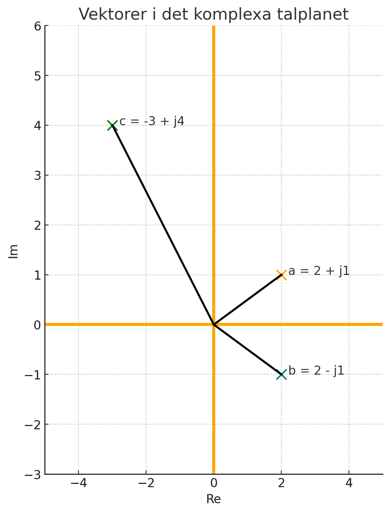

# L18 - Lösningsförslag till lektionsuppgifter

## Del 1 - Repetitionsuppgifter

### 1.1 - Vektorer i det komplexa talplanet

Du har följande vektorer: $a = (2;1)$, $b = (2;-1)$ samt $c = (-3; 4)$. \
I uppgifterna nedan ska varje vektor $(x;y)$ tolkas som ett komplext tal $z = x + jy$.

**a)** Skriv vektorerna på komplex rektangulär form.\
**b)** Rita ut vektorerna i det komplexa talplanet (x-axeln = reell del, y-axeln = imaginär del).\
**c)** Bestäm vektorernas längder, dvs. absolutbeloppet av respektive tal.\
**d)** Bestäm längden (absolutbeloppet) av $a + b + c$, dvs. $|a + b + c|$.\
**e)** Bestäm vektorernas vinklar.\
**f)** Bestäm en vektor $d$ med längden $8$ som är motsatt riktad $c$.

### Lösning

**a)** Vi skriver respektive vektor som ett komplext tal:

```math
a = 2 + j1
```

```math
b = 2 - j1
```

```math
c = -3 + j4
```

**b)** Vi ritar ut respektive vektor i det komplexa talplanet enligt nedanstående figur:



**c)** Vi beräknar vektorernas längder genom att beräkna deras respektive absolutbelopp, vilket enkelt genomförs med Pythagoras sats:

```math
|a| = \sqrt{2^2 + 1^2} = \sqrt{4 + 1} = \sqrt{5} \approx 2,24
```

```math
|b| = \sqrt{2^2 + (-1)^2} = \sqrt{4 + 1} = \sqrt{4} \approx 2,24
```


```math
|c| = \sqrt{(-3)^2 + 4^2} = \sqrt{9 + 16} = \sqrt{25} = 5
```

**d)** Vi börjar med att beräkna $a + b + c$:

```math
a + b + c = 2 + j1 + 2 - j1 -3 + j4
```

Vi kan sedan summera reella delarna av talet:

```math
2 + 2 - 3 = 1
```

samt de imaginära delarna av talet:

```math
j1 - j1 + j4 = j4
```

Därmed gäller att

```math
a + b + c = 1 + j4
```

Absolutbeloppet $|a + b + c| beräknas sedan enkelt med Pythagoras sats:

```math
|a + b + c| = \sqrt{1^2 + 4^2} = \sqrt{1 + 16} = \sqrt{17} \approx 4,1
```

**e)** Vi beräknar vinklarna med $tan^{-1}$. Vi börjar med $δ_a$:

```math
δ_a = \tan^{-1} \frac{1}{2} \approx 0,5 \pm k * \pi rad \approx 26,6^{\circ} \pm k * 180^{\circ}
```

Eftersom $a$ ligger i första kvadranten $(0^{\circ}≤δ_a≤90^{\circ})$ är den beräknade fasvinkeln $δ_a$ korrekt.

Vi fortsätter sedan med $δ_b$:

```math
δ_b = \tan^{-1} \frac{-1}{2} \approx -0,5 \pm k * \pi\,\,rad \approx -26,6^{\circ} \pm k * 180^{\circ}
```

Eftersom $b$ ligger i fjärde kvadranten $(270^{\circ}≤δ_b≤360^{\circ})$ och $-26,6^{\circ} = -360^{\circ} - 26,6^{\circ} = 333,4^{\circ}$ är den beräknade fasvinkeln korrekt.

Vi avslutar sedan med $δ_c$:

```math
δ_c = \tan^{-1} \frac{4}{-3} \approx -0,9 \pm k * \pi\,\,rad \approx -53,1^{\circ} \pm k * 180^{\circ}
```

Eftersom $c$ ligger i andra kvadranten $(90^{\circ}≤δ_c≤180^{\circ})$ adderar vi $\pi = 180^{\circ}$. Vi sätter därmed $k = 1$:

```math
δ_c \approx -0,9 + 1 * \pi \approx 2,2\,\,rad \approx 126,9^{\circ}
```

**f)** 	Den nya vektorn $d$ är motsatt riktad $c$, vilket innebär att dess fasvinkel $δ_d = δ_c \pm \pi$. 
Eftersom $δ_c < \pi$ adderar vi $\pi$:

```math
δ_d = δ_c + \pi \approx 2,2 + \pi \approx 5,4\,\,rad \approx 306,9^{\circ}
```

Vi vet att vektorns längd/absolutbelopp $|d| = 8$. Därmed kan vi beräkna dess reella samt imaginära delar med cosinus samt sinus, då

```math
d = d_{re} + jd_{im},
```

där
* $d_{re}$ = den reella delen,
* $d_{im}$ = den imaginära delen.

Vi beräknar först den reella delen $d_{re}$ med cosinus:

```math
\cos δ_d = \frac{d_{re}}{|d|},
```

vilket kan skrivas om till

```math
d_{re} = |d| * \cos δ_d \approx 8 * \cos 5,4 = 4,8
```

Vi beräknar sedan den imaginära delen $d_{im}$ med sinus:

```math
\sin δ_d = \frac{d_{im}}{|d|},
```

vilket kan skrivas om till

```math
d_{im} = |d| * \sin δ_d \approx 8 * \sin 5,4 = -6,4
```

Därmed kan vektor $d$ skrivas ut på rektangulär form:

```math
d = 4,8 - j6,4
```

---

### 1.2 - Rektangulär form => Eulers form

En spänning $u(t)$  i en växelströmskrets kan representeras av en fasor U, som på rektangulär form skrivs enligt nedan:

```math
U = 3 - j6\,\,V
```

**a)** Rita ut fasorn $U$ i det komplexa talplanet (x-axeln = reell del, y-axeln = imaginär del).\
**b)** Uttryck fasorn $U$ på Eulers form, dvs. bestäm absolutbeloppet $|U|$ samt fasvinkeln $δ$ så att $U = |U|e^{jδ}$.\
**c)** Anta att spänningens frekvens $f = 50$ $Hz$. Bestäm vinkelhastigheten $w$.\
**d)** Skriv $u(t)$ som en tidsberoende funktion $u(t)=|U|*e^{j(wt+δ)}$.


### Lösning

**a)** Vi ritar ut fasorn $U$ i det komplexa talplanet, såsom visas i nedanstående figur:


**b)** Vi bestämmer först fasorns absolutbelopp $|U|$ med Pythagoras sats:

```math
|U| = \sqrt{3^2 + (-6)^2} = \sqrt{9 + 36} = \sqrt{45} \approx 6,7 V
```

Vi bestämmer sedan fasvinkeln $δ$ med $tan^{-1}$:

```math
δ = \tan^{-1} \big({\frac{U_{im}}{U_{re}}}\big) = \tan^{-1} \big({\frac{-6}{3}} \big) \approx -1,1 \pm k * \pi\,\,rad \approx -63,4^{\circ} \pm k * 180^{\circ}
```

Eftersom $U$ ligger i fjärde kvadranten $(270^{\circ}≤δ≤360^{\circ})$ och $-63,4^{\circ} = 360^{\circ} - 63,4^{\circ} = 296,6^{\circ}$ är den bestämda fasvinkeln korrekt.

Vi kan därefter uttrycka fasorn $U$ med Eulers form:

```math
U \approx 6,7e^{-j1,1}\,\,V
```

**c)** Vinkelhastigheten $w$ beräknas med hjälp av frekvensen $f=50$ $Hz$:

```math
w = 2{\pi}f = 2{\pi} * 50 = 100{\pi}\,\,rad/s
```

**d)** Vi skriver om fasor $U$ till motsvarande komplexa spänning u(t) genom att lägga till frekvenskomponenten $wt$:

```math
u(t) \approx 6,7e^{j(wt - 1,1)}\,\,V
```

Vi sätter in den bestämda vinkelhastigheten $w=100π$ $rad/s$ i det bestämda uttrycket för $u(t)$:

```math
u(t) \approx 6,7e^{j(100{\pi}t - 1,1)}\,\,V
```

---

## Del 2 - Nytt stoff

### 2.1 - Addition av tre strömmar i AC-krets

En nod i en elektrisk krets matas med tre sinusformade strömmar: 

```math
i_1(t) = 5{\sin (\omega t + 30^{\circ})}\,\,mA
```

```math
i_2(t) = 3{\sin (\omega t - 30^{\circ})}\,\,mA
```

```math
i_3(t) = 4{\sin (\omega t + 120^{\circ})}\,\,mA
```

Den totala strömmen i kretsen $I_{tot}$ beräknas enligt nedan:

```math
I_{tot}(t) = i_1(t) + i_2(t) + i_3(t)
```

**a)** Skriv om strömmarna $i_1(t)$, $i_2(t)$ samt $i_3(t)$ till fasor $I_1$, $I_2$ samt $I_3$ i komplex rektangulär form.\
**b)** Beräkna fasorsumman $I_{tot} = I_1 + I_2 + I_3$.\
**c)** Rita ut fasorerna i det komplexa talplanet (x-axeln = reell del, y-axeln = imaginär del).\
**d)** Omvandla tillbaka resultatet till en sinusformad ström i tidsdomänen på följande form:

```math
i_{tot}(t) = |I_{tot}|{\sin}(\omega t + δ)
```

### Lösning

**a)** Vi omvandlar sinusspänningarna till motsvarande fasor en efter en:

```math
I_1 = 5{\cos (30^{\circ})} + j5{\sin (30^{\circ})} \approx 4,3 + j2,5\,\,mA
```

```math
I_2 = 3{\cos (-30^{\circ})} + j3{\sin (-30^{\circ})} \approx 2,6 - j1,5\,\,mA
```

```math
I_3 = 4{\cos (120^{\circ})} + j4{\sin (120^{\circ})} \approx -2 + j3,5\,\,mA
```

**b)** Vi summerar strömmarna på rektangulär form och erhåller då den totala strömmen $I_{tot}$:

```math
I_{tot} = I_1 + I_2 + I_3 \approx 4,3 + j2,5 + 2,6 - j1,5 - 2 + j3,5\,\,mA
```

Vi summerar den reella delen av $I_{tot}$:

```math
I_{tot,re} \approx 4,3 + 2,6 - 2 \approx 4,9\,\,mA
```

Vi summerar sedan den imaginära delen av $I_{tot}$:

```math
I_{tot,im} \approx 2,5 - 1,5 + 3,5 \approx 4,5\,\,mA
```

Den totala strömmen $I_{tot}$ kan därmed skrivas ut som visas nedan:

```math
I_{tot} \approx 4,9 + j4,5\,\,mA
```

**c)** Vi ritar ut fasorerna i det komplexa talplanet enligt nedanstående figur:


**d)** Vi omvandlar fasorsumman $I_tot$ till motsvarande sinusformad ström i tidsdomänen:

```math
i_{tot}(t) = |I_{tot}| \sin {({\omega}t + δ_{tot})},
```

där

```math
|I_{tot}| \approx \sqrt{4,9^2 + 4,5^2} \approx 6,6\,\,mA
```

samt

```math
δ_{tot} \approx \tan^{-1} \big({\frac{4,5}{4,9}} \big) \approx \approx 42,2^{\circ} \pm k * 180^{\circ}
```

Eftersom $I_{tot}$ ligger i första kvadranten $(0°≤δ_{tot}≤90°)$ är den beräknade fasvinkeln $δ_{tot}$ korrekt.

Därmed kan sinusspänningen $i_{tot}(t)$ uttryckas enligt nedan:

```math
i_{tot}(t) \approx 6,6 \sin {({\omega}t + 42,2^{\circ})}\,\,mA
```

---